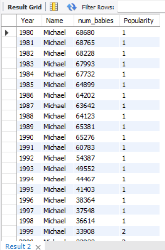

# Baby Name Trend Analysis - SQL Project
This SQL project analyzes U.S. baby name trends from 1980-2010 using Social Security data, completed on Maven Analytics. The dataset covers names by state, gender, and year, with four objectives and detailed CSV outputs.

## Tools Used
- MySQL

## Dataset
- **U.S. Baby Names**: Names, states, genders, and years from 1980-2010.

## Objectives and Files
1. **Track Changes in Name Popularity**
   - Queries: `objective1.sql`
   - Results:
     - Most popular boy names: `objective 1-1_most popular boys names.csv`, snip: `Snip/objective 1-1_snip_most popular boys names.png`
     - Most popular girl names: `objective 1-1_most popular girls names.csv`, snip: `Snip/objective 1-1_snip_most popular girl names.png`
     - Top boy names: `objective 1-1_top boy.png` (note as snip only, no CSV)
     - Top girl names: `objective 1-1_top girl.png` (note as snip only, no CSV)
     - Biggest jumpers: `objective 1-2_biggest jumpers.png` (note as snip only, no CSV yet)
     - Full ranking changes: `objective 1-2_full ranking changes 1980-2010.csv`
2. **Compare Popularity Across Decades**
   - Queries: `objective2.sql`
   - Results:
     - Top girl/boy names by year: `objective 2-1_most popular girl and boy name over the year.csv`, snip: `Snip/objective 2-1_most popular girl and boy name over the year.png`
     - Top girl/boy names by decade: `objective 2-2_most popular girl and boy name over the decade.csv`, snip: `Snip/objective 2-2_most popular girl and boy name over the decade.png`
3. **Compare Popularity Across Regions**
   - Queries: `objective3.sql`
   - Results:
     - Babies born per region: `Snip/objective 3-1_babies born in each of the six regions.png` (note as snip only, no CSV yet)
     - Top girl/boy names per region: `objective 3-2_most popular girl names and most popular boy names within each region.csv`, snip: `Snip/objective 3-2_most popular girl names and 3 most popular boy names within each region.png`
4. **Explore Unique Names**
   - Queries: `objective4.sql`
   - Results:
     - 10 most popular androgynous names: `Snip/objective 4-1_10 most popular androgynous names.png` (note as snip only, no CSV yet)
     - Shortest/longest name lengths: `objective 4-2_length of the shortest and longest names.csv`
     - State with highest "Chris" percentage: `objective 4-3_percent of babies named Chris.csv`

## Key Insights
- Tracked shifts from classic to modern names over time.
- Identified regional naming differences (e.g., South vs. Northeast).
- Found androgynous names like "Michael", "Christopher", "Joshua".
- LA had the highest "Chris" percentage (update with your result from `objective 4-3_percent of babies named Chris.csv`).

## How to Run
- Run `.sql` files in a SQL tool (e.g., MySQL Workbench) with the dataset; view results in `.csv` files and snips in `Snip/`.

